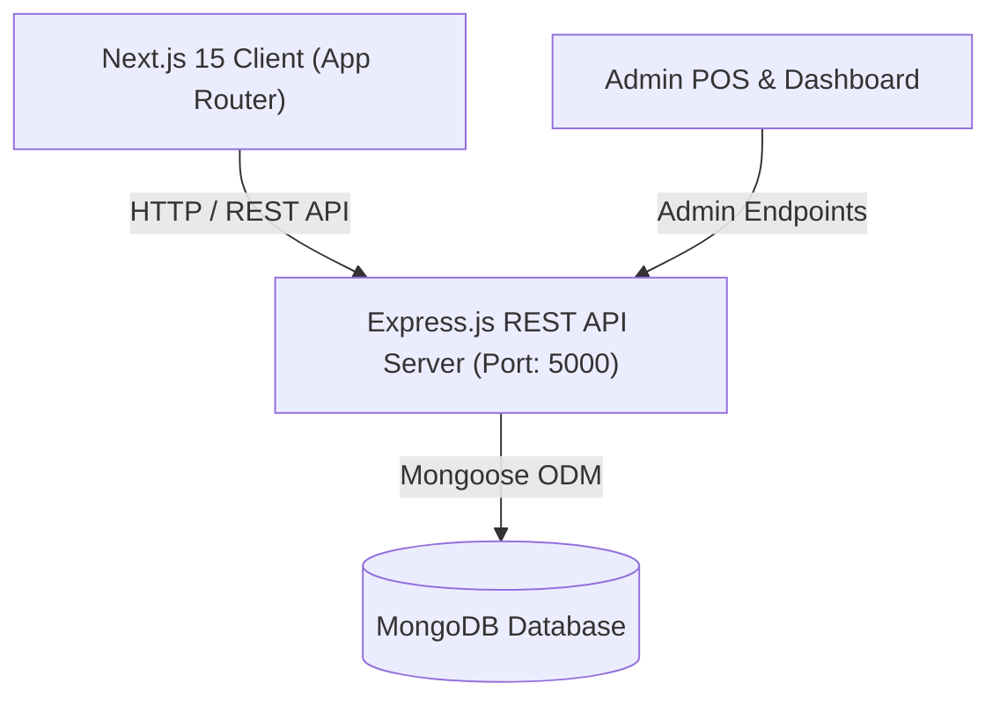

<div align="center">

# ⚡ K H E O O
### *Next-Gen Luxury Streetwear & Heavyweight Drop Shoulder Apparel Platform*

[](https://nextjs.org/)
[](https://www.typescriptlang.org/)
[](https://tailwindcss.com/)
[](https://nodejs.org/)
[](https://expressjs.com/)
[](https://www.mongodb.com/)

<p align="center">
  <a href="#-overview">Overview</a> •
  <a href="#-features">Features</a> •
  <a href="#-tech-stack">Tech Stack</a> •
  <a href="#-architecture">Architecture</a> •
  <a href="#-getting-started">Getting Started</a> •
  <a href="#-api-reference">API Reference</a> •
  <a href="#-project-structure">Structure</a>
</p>

---

</div>

## 🌌 Overview

**KHEOO** is an ultra-premium, high-performance e-commerce ecosystem designed specifically for modern and minimalist streetwear enthusiasts in Bangladesh. Engineered with a cutting-edge frontend powered by **Next.js 15 App Router** and a robust **Express.js & MongoDB** backend, KHEOO delivers a blisteringly fast shopping experience for 240+ GSM heavyweight drop shoulder tees, anime capsule drops, and comic-inspired streetwear.

---

## ✨ Key Features

### 🛍️ Client & Storefront Experience
- **⚡ Next Drop Countdown**: Live real-time flip clock countdown timer with interactive VIP email notification alert system for upcoming capsule releases.
- **🎯 Dynamic Shop by Category**: Multi-card visual layout featuring large lifestyle hero showcases and 2x2 responsive category collections.
- **🧭 Interactive MegaMenu**: Responsive desktop navigation featuring instant hover previews that dynamically switch drop images and tags.
- **🔍 Advanced Shop Filtering & Search**: Instant filtering by category, live keyword search, price range, and multi-parameter sorting.
- **🛒 High-Performance Cart Drawer**: Seamless slide-out bag with instant quantity adjusters, subtotal recalculations, and coupon application (`KHEOO10`).
- **🤍 Wishlist & Local Persistence**: Instant client-side item bookmarking with localStorage state persistence.
- **📍 Live Order Tracker**: Real-time multi-stage status progress bar tracking fulfillment from dispatch to doorstep delivery.
- **📱 Mobile-First Responsive UI**: Custom touch-optimized layouts for mobile devices, bottom drawer interactions, and zero-clutter clean interfaces.

### 🛡️ Admin & POS System
- **📊 Real-Time Admin Analytics**: Live sales dashboard displaying daily revenue, transaction volume, pending order queues, and inventory alerts.
- **💳 Built-In POS (Point of Sale)**: Fast cashier interface with instant customer lookup, barcode search, multi-item invoicing, and receipt printing.
- **📦 Full Lifecycle Order Management**: Status updates (`Pending`, `Confirmed`, `Shipped`, `Delivered`, `Cancelled`) with automated tracking code generations.

---

## 🛠️ Tech Stack

### **Frontend (`kheoo-client-side`)**
| Technology | Description |
|---|---|
| **Next.js 15** | React Framework with App Router, SSR, and Server Components |
| **React 19** | UI Component Architecture & Modern Hooks |
| **TypeScript** | Strict End-to-End Type Safety |
| **Tailwind CSS** | Custom Utility-First Styling System & Design Tokens |
| **Lucide React** | Clean, Optimized Vector Iconography |

### **Backend (`kheoo-server-side`)**
| Technology | Description |
|---|---|
| **Node.js** | Server-Side JavaScript Runtime |
| **Express.js** | Modular RESTful API Framework |
| **MongoDB & Mongoose** | Document Database & Object Data Modeling |
| **CORS & Dotenv** | Security, Environment Config & Middleware |

---

## 🏛️ System Architecture



---

## 📂 Project Structure

```
kheoo/
├── 📁 kheoo-client-side/          # Next.js 15 Storefront
│   ├── 📁 public/                 # Static assets, fonts, brand logos
│   └── 📁 src/
│       ├── 📁 app/                # App Router Pages
│       │   ├── 📁 (auth)/login    # Authentication portal
│       │   ├── 📁 admin/          # Dashboard & POS interface
│       │   ├── 📁 shop/           # Filterable catalog & search
│       │   ├── 📁 anime/          # Anime streetwear collection
│       │   ├── 📁 marvel/         # Marvel drops
│       │   ├── 📁 dc/             # DC Tactical gear
│       │   ├── 📁 new-drops/      # Exclusive releases & countdown
│       │   ├── 📁 checkout/       # Secure order placement
│       │   └── 📁 track-order/    # Live package tracker
│       ├── 📁 components/         # Reusable UI Blocks
│       │   ├── 📁 home/           # Hero, Countdown, Categories, NewArrivals
│       │   ├── 📁 layout/         # Header, MegaMenu, Footer, CartDrawer
│       │   └── 📁 product/        # ProductCard, ProductGrid
│       ├── 📁 context/            # React Context (Cart, Wishlist, Auth)
│       ├── 📁 data/               # Product fallback catalogues
│       └── 📁 types/              # Unified TypeScript definitions
│
└── 📁 kheoo-server-side/          # Express.js REST API
    └── 📁 src/
        ├── 📁 config/             # Database connection & env setup
        ├── 📁 controllers/        # Business logic (Products, Orders, Auth)
        ├── 📁 models/             # Mongoose Schemas (Product, Order, User)
        ├── 📁 routes/             # API Route Handlers
        └── server.ts              # Server Entrypoint
```

---

## 🚀 Getting Started

### 1. Clone the Repository
```bash
git clone https://github.com/tayabunn/kheoo.git
cd kheoo
```

### 2. Configure Backend Server
```bash
cd kheoo-server-side
npm install

# Create .env file
# PORT=5000
# MONGO_URI=mongodb+srv://...

npm run dev
```

### 3. Configure Frontend Client
```bash
cd ../kheoo-client-side
npm install

# Create .env.local file
# NEXT_PUBLIC_API_URL=http://localhost:5000/api/v1

npm run dev
```

Visit **`http://localhost:3000`** in your browser to view the application.

---

## 🔌 API Reference Overview

| Method | Endpoint | Description |
|---|---|---|
| `GET` | `/api/v1/products` | Retrieve all active products & drops |
| `GET` | `/api/v1/products/:id` | Fetch single product details by ID or slug |
| `POST` | `/api/v1/orders` | Create a new customer or POS order |
| `GET` | `/api/v1/orders/track/:orderId` | Track package shipment progress |
| `PATCH` | `/api/v1/orders/:id/status` | Update fulfillment state *(Admin)* |

---

## 🎨 Design Philosophy
- **Minimalist Monochrome**: Strict black-and-white foundation with purposeful contrast.
- **Ultra-Readable Typography**: High-density bold geometric headers paired with clean monospace badges.
- **Tactile Micro-Interactions**: Smooth hover elevations, scale animations, and instantaneous state feedback.

---

<div align="center">

Crafted with 🖤 for the Streetwear Culture by **Tayabunn**

</div>
